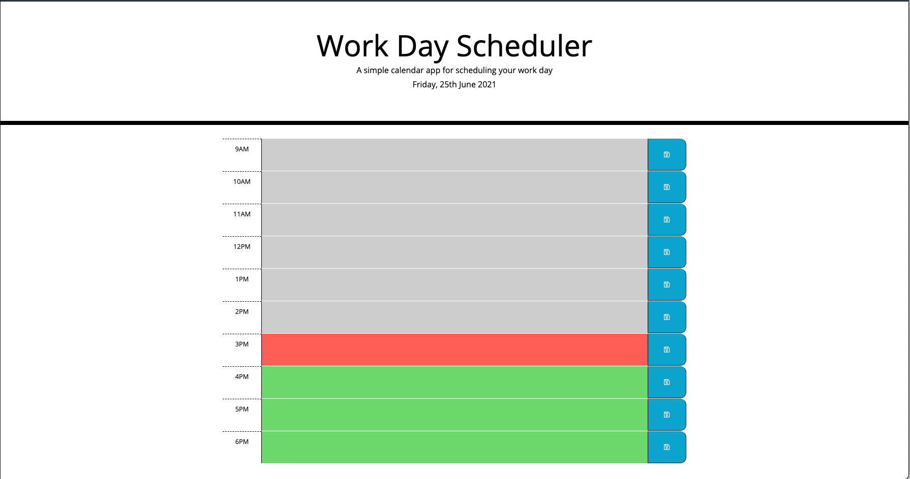

# 05-work-day-scheduler

## Task

In this project, I was tasked to write a work day scheduler with the following features:
- When the page is load initially, the current day should appear at the top.
- The user will be presented with time blocks, each corresponding to an hour of standard working day.
- Each time block will be colour coded to represent past, present and future.
- The user can write enter event/s/tasks on each time block.
- These can be saved by clicking on the button to the right.
- These will be saved in local storage, so that they can load on reloading the page.

### Preview

The end product should resemble the mock-up provided below:

> **Note:** This layout will not look as good when the resolution drops below 768px.

## Installation
[(Back to top)](#task)

To use this project, first clone the repo on your device using the commands below:

    git init
    git clone https://github.com/Supasiti/05-work-day-scheduler.git

## Usage
[(Back to top)](#task)

The final webpage can be accessed through the following [link](https://supasiti.github.io/05-work-day-scheduler/).

## Design Consideration
[(Back to top)](#task)

### Third party libraries
- In this module, 
  - Bootstrap was used extensively for styling and layout;
  - jQuery was used to interact with web API; and
  - moment.js was used to manage time object consistently.
- I tried to minimise using Bootstrap as much as possible to give a unique feel. 

### Coding style
- the code is separated into
  - rendering of the page; and 
  - handling user data.
- It is possible to combine the rendering of the background colour of each time block (`setAllTextAreasBackgroundColor`) with `createTimeBlock` function, but by separating them out, it would be easier later if one choose to update the background colour as hours change.
- The page will not update if the present hour changes, but this functionality can be added in.
- I think that `printTasks` function is computationally inexpensive enough to be separate from `createTimeBlock` function. If this is an issue, it is not too hard to insert it back in.
